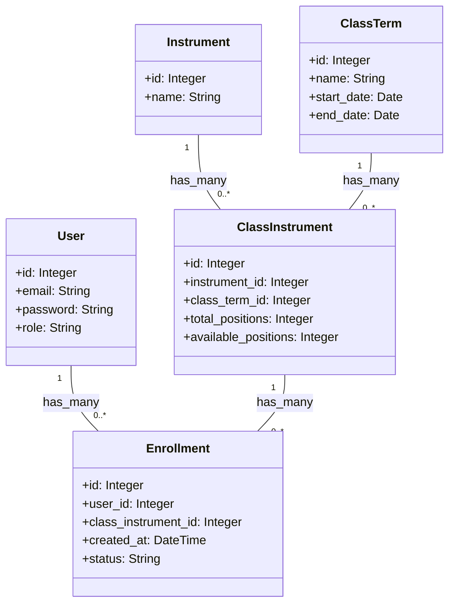

## TO DO

- [ ] que dia termina a turma 1? quando vai ser a inscrição?

Feature CRUD de naipes:
O objetivo é setar a aplicação com um crud simples funcional e termos experiência prática 
- [x] setup
- [x] add tailwind
- [x] add gerador para criar entidades
- [x] add gerador para criar repositorios
- [x] add gerador para criar casos de uso
- [x] definir layout
- [x] add layout component
- [x] add application menus
- [x] add link para naipes
- [x] add link para turmas
- [x] add layout management com 3 colunas
- [x] add listagem de naipes
- [x] add FormBuiler
- [ ] usar turbo-streams/stimulus para evitar carregar todo o html (precisamos nos familiarizar)
- [ ] add editar naipe
- [ ] add apagar naipe

Feature: CRUD de turmas
Cadastrar turma definindo número de vagas para cada Naipe.

- [ ] ...


Feature: Permitir inscrições para a turma aberta
* Add form em link publico
* Add tela de confirmação
* Lembrar de não limitar as inscrições por número de vagas (se passar de inscritos haverá sorteio)

Feature: Add usuário admin
* Todas as páginas são privadas, menos home e da inscrição. 
* Podemos usar autenticação do Facebook para o admin
* Por ora um inscrito não é usuário

Feature: Sortear inscritos para uma turma


### might do

- [ ] Add gerador para activerecord repository
- [ ] Add gerador para UseCases (identificar por padrão os verbos de CRUD.. List<Entity>, CreateNew<Entity>, etc)
- [ ] Gerador de CRUD gerar tbm os tests com MiniTest

# Architecture (outdated!! should be updated!)

## Data Modelling

To design the data model for this app, we'll need to create several models representing the different entities involved in the enrollment process. Here's a high-level overview of the models and their relationships:

1. User
- Attributes: id, email, password, role (admin or regular user)
- Associations: none

2. Instrument
- Attributes: id, name (Agbe, Alfaia, Caixa, Dança)
- Associations: has_many :class_instruments

3. ClassTerm
- Attributes: id, name, start_date, end_date
- Associations: has_many :class_instruments

4. ClassInstrument
- Attributes: id, instrument_id, class_term_id, total_positions, available_positions
- Associations: belongs_to :instrument, belongs_to :class_term, has_many :enrollments

5. Enrollment
- Attributes: id, user_id, class_instrument_id, created_at, status (pending, accepted, rejected)
- Associations: belongs_to :user, belongs_to :class_instrument

Here's a brief description of each model:

- User: Represents the admin or the person registering for a class. The User model has basic authentication-related fields (email, password), and a role to differentiate between admin and regular users.

- Instrument: Represents the four instruments you mentioned (Agbe, Alfaia, Caixa, and Dança). This model will store the name of each instrument.

- ClassTerm: Represents each of the three classes opened per year. It will store the name, start_date, and end_date of the class.

- ClassInstrument: Represents the relationship between a ClassTerm and an Instrument. It stores the total_positions available for each instrument in a class term and the number of available_positions. This model has associations with both the ClassTerm and Instrument models.

- Enrollment: Represents a registration by a user for a specific instrument in a class term. It has a status field to store the current status of the enrollment (pending, accepted, or rejected). This model has associations with the User and ClassInstrument models.

These models should provide a solid foundation for managing the enrollment process in your Ruby on Rails application. You can further customize them as needed to meet specific requirements.

### Class Diagram



## Clean Archhitecture
This iss an example of how to structure your Ruby on Rails application using Clean Architecture principles. The focus will be on the Enrollment use case:

1. Domain (Core Business Logic)

- app/domain/entities/enrollment.rb

```ruby
class Enrollment
  attr_reader :id, :user_id, :class_instrument_id, :created_at, :status

  def initialize(id:, user_id:, class_instrument_id:, created_at:, status:)
    @id = id
    @user_id = user_id
    @class_instrument_id = class_instrument_id
    @created_at = created_at
    @status = status
  end
end
```

2. Application (Use Cases)

- app/application/use_cases/create_enrollment.rb

```ruby
class CreateEnrollment
  def initialize(enrollment_repository)
    @enrollment_repository = enrollment_repository
  end

  def call(user_id:, class_instrument_id:)
    enrollment = Enrollment.new(
      id: nil,
      user_id: user_id,
      class_instrument_id: class_instrument_id,
      created_at: Time.now,
      status: 'pending'
    )

    @enrollment_repository.save(enrollment)
  end
end
```

3. Infrastructure (Frameworks, Databases, etc.)

- app/infrastructure/repositories/enrollment_repository.rb

```ruby
class EnrollmentRepository
  def save(enrollment)
    enrollment_record = EnrollmentRecord.create(
      user_id: enrollment.user_id,
      class_instrument_id: enrollment.class_instrument_id,
      created_at: enrollment.created_at,
      status: enrollment.status
    )

    enrollment.instance_variable_set(:@id, enrollment_record.id)
    enrollment
  end
end
```

- app/models/enrollment_record.rb

```ruby
class EnrollmentRecord < ApplicationRecord
  self.table_name = 'enrollments'
  belongs_to :user
  belongs_to :class_instrument
end
```

4. Adapters (Controllers, Presenters, etc.)

- app/controllers/enrollments_controller.rb

```ruby
class EnrollmentsController < ApplicationController
  def create
    create_enrollment = CreateEnrollment.new(EnrollmentRepository.new)
    enrollment = create_enrollment.call(
      user_id: params[:user_id],
      class_instrument_id: params[:class_instrument_id]
    )

    render json: { enrollment_id: enrollment.id, message: 'Enrollment created successfully.' }
  end
end
```

This example demonstrates how to create an enrollment using Clean Architecture. The core business logic is encapsulated in the `Enrollment` entity, and the `CreateEnrollment` use case interacts with it. The `EnrollmentRepository` handles the persistence, while the `EnrollmentsController` acts as an adapter between the use case and the Rails framework.

This structure keeps concerns separated and makes the code more maintainable, testable, and scalable. You can extend this example to include other entities and use cases for your application.

### Sortitions

To handle the sortition when there are more registrations than vacancies, you can create a separate use case for conducting the sortition. Here's a basic example:

1. Application (Use Cases)

- app/application/use_cases/conduct_sortition.rb

```ruby
class ConductSortition
  def initialize(enrollment_repository)
    @enrollment_repository = enrollment_repository
  end

  def call(class_instrument_id:)
    pending_enrollments = @enrollment_repository.find_by_class_instrument_id_and_status(class_instrument_id, 'pending')
    available_positions = pending_enrollments.first.class_instrument.available_positions

    if pending_enrollments.count > available_positions
      selected_enrollments = pending_enrollments.sample(available_positions)

      selected_enrollments.each do |enrollment|
        enrollment.status = 'accepted'
        @enrollment_repository.update(enrollment)
      end

      (pending_enrollments - selected_enrollments).each do |enrollment|
        enrollment.status = 'rejected'
        @enrollment_repository.update(enrollment)
      end
    else
      pending_enrollments.each do |enrollment|
        enrollment.status = 'accepted'
        @enrollment_repository.update(enrollment)
      end
    end
  end
end
```

In this use case, we first fetch all the pending enrollments for a specific class instrument. Then we check if there are more enrollments than available positions. If that's the case, we randomly select enrollments to fill the available positions, update their status to 'accepted', and update the remaining enrollments' status to 'rejected'. If there are fewer enrollments than available positions, we simply update all pending enrollments' status to 'accepted'.

You can call this use case from a controller or a background job when the sortition needs to be conducted, for example, after the registration period ends.

### Example: how to list all open enrollment processes?

To list all open enrollment processes, you can create a use case that fetches all ClassTerm instances with their related ClassInstruments, where the start_date is in the future or the end_date is not yet passed. You can then call this use case from a controller to display the open enrollment processes in the view.

1. Application (Use Cases)

- app/application/use_cases/list_open_enrollment_processes.rb

```ruby
class ListOpenEnrollmentProcesses
  def initialize(class_term_repository)
    @class_term_repository = class_term_repository
  end

  def call
    @class_term_repository.find_open_enrollments
  end
end
```

2. Infrastructure (Frameworks, Databases, etc.)

- app/infrastructure/repositories/class_term_repository.rb

```ruby
class ClassTermRepository
  def find_open_enrollments
    ClassTerm.includes(:class_instruments)
             .where('start_date >= ? OR end_date >= ?', Date.today, Date.today)
             .references(:class_instruments)
  end
end
```

3. Adapters (Controllers, Presenters, etc.)

- app/controllers/open_enrollment_processes_controller.rb

```ruby
class OpenEnrollmentProcessesController < ApplicationController
  def index
    list_open_enrollment_processes = ListOpenEnrollmentProcesses.new(ClassTermRepository.new)
    @open_enrollment_processes = list_open_enrollment_processes.call
  end
end
```

4. Views

- app/views/open_enrollment_processes/index.html.erb

```html
<h1>Open Enrollment Processes</h1>

<table>
  <thead>
    <tr>
      <th>Class Term</th>
      <th>Start Date</th>
      <th>End Date</th>
      <th>Instrument</th>
      <th>Available Positions</th>
    </tr>
  </thead>
  <tbody>
    <% @open_enrollment_processes.each do |class_term| %>
      <% class_term.class_instruments.each do |class_instrument| %>
        <tr>
          <td><%= class_term.name %></td>
          <td><%= class_term.start_date %></td>
          <td><%= class_term.end_date %></td>
          <td><%= class_instrument.instrument.name %></td>
          <td><%= class_instrument.available_positions %></td>
        </tr>
      <% end %>
    <% end %>
  </tbody>
</table>
```

This example demonstrates how to fetch and display all open enrollment processes. The `ListOpenEnrollmentProcesses` use case fetches open ClassTerm instances with their related ClassInstruments, and the `OpenEnrollmentProcessesController` calls this use case and assigns the result to an instance variable. The view then iterates through the open enrollment processes and displays them in a table.

### Folders & Files (WIP)

Here's a representation of the file tree for the project, including some of the classes discussed earlier:

```
.
├── app
│   ├── application
│   │   ├── use_cases
│   │   │   ├── conduct_sortition.rb
│   │   │   ├── create_enrollment.rb
│   │   │   └── list_open_enrollment_processes.rb
│   ├── controllers
│   │   ├── enrollments_controller.rb
│   │   └── open_enrollment_processes_controller.rb
│   ├── domain
│   │   ├── entities
│   │   │   ├── class_instrument.rb
│   │   │   ├── class_term.rb
│   │   │   ├── enrollment.rb
│   │   │   ├── instrument.rb
│   │   │   └── user.rb
│   ├── infrastructure
│   │   ├── repositories
│   │   │   ├── class_instrument_repository.rb
│   │   │   ├── class_term_repository.rb
│   │   │   ├── enrollment_repository.rb
│   │   │   ├── instrument_repository.rb
│   │   │   └── user_repository.rb
│   ├── models
│   │   ├── class_instrument_record.rb
│   │   ├── class_term_record.rb
│   │   ├── enrollment_record.rb
│   │   ├── instrument_record.rb
│   │   └── user_record.rb
│   └── views
│       └── open_enrollment_processes
│           └── index.html.erb
├── config
│   ├── database.yml
│   └── ...
├── db
│   ├── migrate
│   │   ├── XXX_create_users.rb
│   │   ├── XXX_create_instruments.rb
│   │   ├── XXX_create_class_terms.rb
│   │   ├── XXX_create_class_instruments.rb
│   │   └── XXX_create_enrollments.rb
│   └── schema.rb
├── Gemfile
├── Gemfile.lock
└── config.ru
```

In this file tree, the core logic and use cases are organized under the `app/domain/entities` and `app/application/use_cases` directories, respectively. The repositories for handling persistence are in the `app/infrastructure/repositories` directory. Controllers, models, and views are organized in their respective directories under `app/`. The database migrations are stored under `db/migrate`.

### Generators

Here is the final version of the `CRUDGenerator` class:

```ruby
class CRUDGenerator < Rails::Generators::NamedBase
  source_root File.expand_path('templates', __dir__)
  
  class_option :actions, type: :array, default: [], desc: "Select specific actions to generate (index, new, show, edit, create, update, destroy)"

  def create_domain_files
    template "domain_entity.rb.tt", File.join("app/domain/entities", class_path, "#{file_name}.rb")
    template "domain_repository_interface.rb.tt", File.join("app/domain/repositories", class_path, "#{file_name}_repository.rb")
  end

  def create_application_files
    template "application_use_case.rb.tt", File.join("app/application/use_cases", class_path, "#{file_name}", "#{file_name}_interactor.rb")
  end

  def create_infrastructure_files
    template "infrastructure_repository.rb.tt", File.join("app/infrastructure/repositories", class_path, "#{file_name}_repository.rb")
  end

  def create_adapter_files
    template "adapter_controller.rb.tt", File.join("app/controllers", class_path, "#{plural_file_name}_controller.rb") if allowed_actions.any?
  end

  def create_active_record_model
    generate "model", "#{file_name}_record #{attributes.map(&:to_s).join(' ')} --no-test-framework"
  end

  def create_views
    create_index_view if allowed_actions.include?("index")
    create_new_view if allowed_actions.include?("new") || allowed_actions.include?("create")
    create_edit_view if allowed_actions.include?("edit") || allowed_actions.include?("update")
    create_show_view if allowed_actions.include?("show")
    create_partial_form_view if allowed_actions.include?("new") || allowed_actions.include?("create") || allowed_actions.include?("edit") || allowed_actions.include?("update")
  end

  def create_index_view
    template "adapter_views/index.html.erb.tt", File.join("app/views", plural_file_name, "index.html.erb")
  end

  def create_new_view
    template "adapter_views/new.html.erb.tt", File.join("app/views", plural_file_name, "new.html.erb")
  end

  def create_edit_view
    template "adapter_views/edit.html.erb.tt", File.join("app/views", plural_file_name, "edit.html.erb")
  end

  def create_show_view
    template "adapter_views/show.html.erb.tt", File.join("app/views", plural_file_name, "show.html.erb")
  end

  def create_partial_form_view
    template "adapter_views/_form.html.erb.tt", File.join("app/views", plural_file_name, "_form.html.erb")
  end

  private

  def allowed_actions
    options[:actions].any? ? options[:actions] : %w[index new show edit create update destroy]
  end
end
```

Make sure to update the template file paths in the `source_root` line at the beginning of the class definition to match the new name of the generator.

Now, when you run the generator with the following command:

```sh
rails g crud Instrument name --actions index,new
```

It will generate only the specified actions (index and new) for the Instrument controller and views.